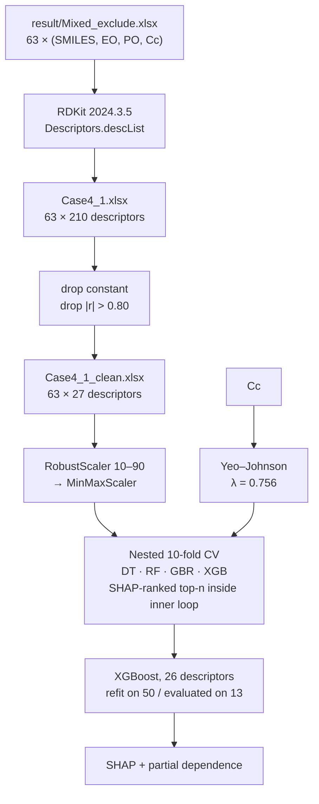

<h1 align="center">Interpretable QSPR Modeling of Surfactant Characteristic Curvature</h1>

<p align="center">
  Predicting the HLD characteristic curvature (C<sub>c</sub>) of anionic and nonionic surfactants
  from 2D RDKit descriptors, with SHAP and partial-dependence interpretation.
</p>

<p align="center">
  
  
  
  
  
</p>

---

## Why this exists

Characteristic curvature is the surfactant term in the hydrophilic–lipophilic deviation (HLD) equation. It sets which way an interface wants to bend, and it is the one HLD input that depends on the surfactant rather than on the formulation. Measuring it means salinity phase-inversion scans or interfacial-tension series — days of bench work per compound.

This repository fits C<sub>c</sub> from molecular structure alone, so a candidate list can be narrowed before anyone opens a vial. Because C<sub>c</sub> enters HLD additively with a coefficient of one, a prediction error of ΔC<sub>c</sub> shifts the predicted HLD by exactly the same amount, which matters most near the HLD = 0 balance point.

**Scope.** 63 surfactants: 25 anionic (sulfates, sulfonates, sulfosuccinates) and 38 nonionic ethoxylates, compiled from 16 literature sources. Cationic, zwitterionic and gemini surfactants are absent from the dataset, not merely rare in it. Predictions outside the represented chemistry are not supported.

## Pipeline



## Contents

| Path | |
|---|---|
| `Interpretable QSPR Modeling of Surfactant Characteristic Curvature.ipynb` | The full analysis, 109 code cells. Outputs cleared — run top to bottom to regenerate. |
| `result/Mixed_exclude.xlsx` | **The dataset.** The only hand-curated file; everything else derives from it. |
| `Case4_1.xlsx` | Generated: source columns + all 210 RDKit descriptors. |
| `Case4_1_clean.xlsx` | Generated: `Cc` + the 27 descriptors that survive filtering. |
| `requirements.txt` | Pinned dependencies. |

`descriptors_cleaned_RDkit_mix_Exclude.xlsx` is written by the notebook and is byte-identical to `Case4_1_clean.xlsx`, so it is gitignored rather than committed.

### The dataset

| Column | Type | |
|---|---|---|
| `SMILES` | str | Canonical SMILES. Sodium counterions stripped from all anionic surfactants, so heads appear as bare anions (`CCCCCCCC(=O)[O-]`). |
| `EO` | int | Ethylene oxide units, 0–14. Bookkeeping; dropped before modeling. |
| `PO` | int | Propylene oxide units, 0–18. Bookkeeping; dropped before modeling. |
| `Cc` | float | Experimental characteristic curvature. −4.40 to +3.50, mean −0.95, skewness +0.56. |

The 27 descriptors that survive filtering:

```
MaxAbsEStateIndex  MinAbsEStateIndex  MinEStateIndex  qed  SPS  MolWt
FpDensityMorgan1   BCUT2D_MWLOW  BCUT2D_LOGPHI  BCUT2D_MRLOW  BalabanJ
HallKierAlpha  Ipc  PEOE_VSA6  PEOE_VSA8  PEOE_VSA10  PEOE_VSA11
PEOE_VSA14  SMR_VSA4  SMR_VSA7  SlogP_VSA1  EState_VSA4  EState_VSA8
VSA_EState2  VSA_EState5  fr_Al_COO  fr_allylic_oxid
```

## Results

| | R² | RMSE | MAE |
|---|---|---|---|
| Nested 10-fold CV, mean over outer folds | **0.601** | 0.549 | 0.416 |
| Training set (n = 50) | 0.999 | 0.059 | 0.041 |
| Test set (n = 13) | 0.849 | 0.526 | 0.442 |


An MAE of 0.44 C<sub>c</sub> units is the same order as reported experimental uncertainty (≈ ±0.2 for alkyl ethoxylates, ≈ 0.2–1 for ionic surfactants), which is why the model is positioned as a pre-screening aid rather than a substitute for measurement. Largest evaluation-set deviations: Tween-80 (AE 0.99), C12EO5 (0.79), C6EO3 (0.75).

## Environment

Run on **CPython 3.12** (kernel metadata: 3.12.3), Windows x64.

| | | |
|---|---|---|
| rdkit | 2024.3.5 | SMILES parsing, the 210 `Descriptors.descList` descriptors |
| scikit-learn | 1.4.2 | splits, `KFold`, `GridSearchCV`, `PowerTransformer`, scalers, DT/RF/GBR, metrics, `partial_dependence` |
| xgboost | 2.1.0 | `XGBRegressor` — the final model |
| shap | 0.46.0 | `TreeExplainer`, bar and beeswarm plots |
| numpy · pandas · scipy | 2.0.1 · 2.3.3 · 1.13.1 | |
| matplotlib · seaborn | 3.10.7 · 0.13.2 | |
| openpyxl · joblib · tqdm | 3.1.5 · 1.4.2 · 4.66.5 | |

> **The RDKit version is load-bearing.** `Descriptors.descList` is not stable across releases; 2024.3.5 is what yields the 210-descriptor starting set. A different RDKit changes the descriptor count and can change which 27 survive filtering.

```bash
git clone https://github.com/Fuggerous/Interpretable-QSPR-Modeling-of-Surfactant-Characteristic-Curvature.git
cd Interpretable-QSPR-Modeling-of-Surfactant-Characteristic-Curvature

python3.12 -m venv .venv
source .venv/bin/activate          # Windows: .venv\Scripts\activate
pip install -r requirements.txt

jupyter lab
```

Paths in the notebook are relative to the repository root, so launch Jupyter from there. Runtime is dominated by the nested grid searches: tens of minutes to a few hours depending on core count.

## What the notebook does

**Descriptors.** Parses each SMILES with `Chem.MolFromSmiles`, sanitizes explicitly, computes every entry in `Descriptors.descList`. Explicit hydrogens are deliberately not added, so all counts refer to the heavy-atom graph.

**Filtering.** Drop descriptors with one unique value, then scan the upper triangle of the absolute Pearson matrix and drop the later column of each pair above 0.80. 210 → 27.

**Target.** `PowerTransformer(method='yeo-johnson')`, λ = 0.756. Skewness 0.5615 → 0.0916, kurtosis −0.0839 → −0.5138. Every reported metric is computed after `pt.inverse_transform`, on the original C<sub>c</sub> scale.

**Scaling.** `RobustScaler(quantile_range=(10, 90))` then `MinMaxScaler()`, as one `Pipeline`. The 10–90 range rather than the IQR because several VSA- and EState-family descriptors are zero for most compounds, which makes a 25–75 spread degenerate.

**Benchmarking.** Decision tree, random forest, gradient boosting and XGBoost, each grid-searched across the full design space: StandardScaler vs. RobustScaler, raw vs. Yeo–Johnson target, 5- vs. 10-fold, non-nested vs. nested. One notebook section per combination.

**Final model.** Nested 10-fold CV, `KFold(n_splits=10, shuffle=True, random_state=42)` at both levels. A wrapper inside each inner fold ranks descriptors by mean |SHAP| and evaluates the top *n*, with *n* tuned alongside the hyperparameters. Grid actually searched:

```python
{'n_estimators': [900, 1000, 1100, 1200],
 'max_depth': [3],
 'learning_rate': [0.01, 0.02],
 'subsample': [1.0, 0.8, 0.6],
 'reg_lambda': [1, 5, 10],
 'reg_alpha': [0, 0.1, 1],
 'gamma': [0, 0.1, 1],
 'min_child_weight': [5, 10]}
```

The adopted configuration comes from outer fold 3 (R² 0.910) and uses 26 of the 27 descriptors. It is refit on an 80/20 split, `train_test_split(test_size=0.2, random_state=42)` → 50 / 13.

**Interpretation.** `shap.TreeExplainer` on the final model for mean |SHAP| rankings and beeswarm plots, plus partial-dependence curves for the highest-ranked descriptors.

## Reproducibility notes


**SHAP values are computed on training data** — `explainer_final.shap_values(X_train_full_optimal)`, 50 molecules. The saved plot is titled "Final Model (Training Data)". Read the rankings as a description of the fitted model, not as out-of-sample attribution.

**Training R² is 0.999.** The model interpolates its training set; with 50 samples and 1200 boosted trees that is expected, and it means the train–evaluation gap is the only usable evidence about generalization.

**`n_estimators = 1200` sits at the top of the searched grid**, so the optimum in ensemble size was not bracketed.

**Determinism.** `random_state=42` throughout, so reruns on the pinned versions reproduce exactly. A different RDKit or scikit-learn can change the descriptor set or the fold assignment, and therefore the numbers.

## Citation

> Dulyadech, A.; Suriyapraphadilok, U.; Charoensaeng, A.; Sueviriyapan, N. *Interpretable QSPR Modeling of Surfactant Characteristic Curvature.* Manuscript in preparation.

The C<sub>c</sub> values are compiled from 16 published sources; cite those originals when reusing the underlying measurements.

## License

Not yet licensed

## Contact

**Natthapong Sueviriyapan** · natthapong.su@chula.ac.th
The Petroleum and Petrochemical College, Chulalongkorn University, Bangkok 10330, Thailand
